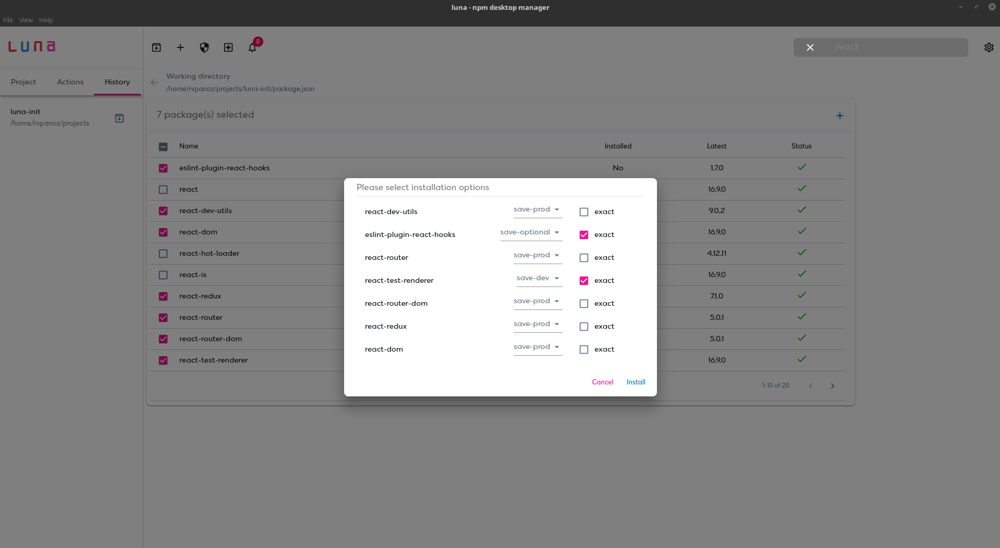
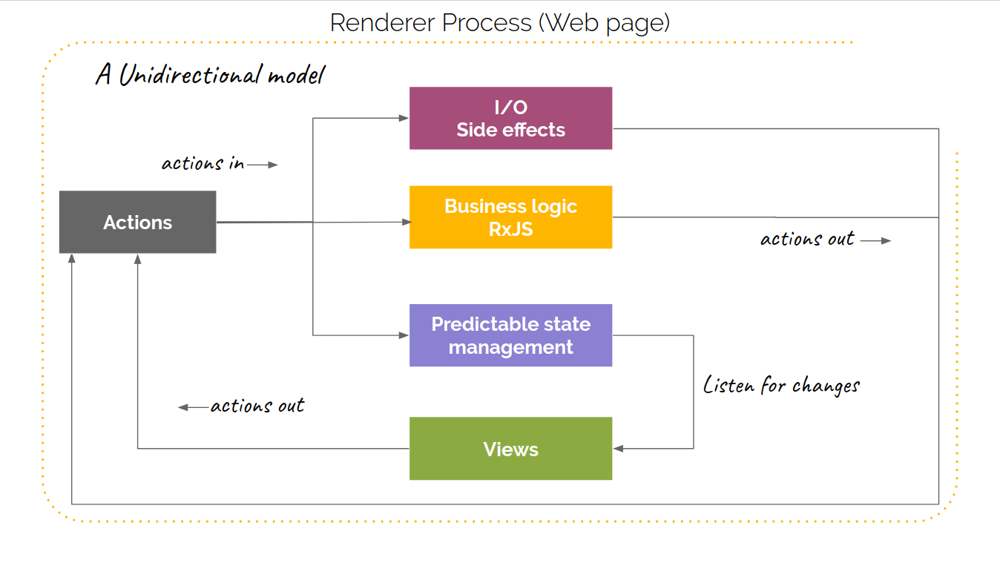

## Luna - npm management through a modern UI. Built with Electron :hibiscus:

  

npm desktop manager for handling npm dependencies. Supported platforms: OS X Windows and Linux.

---

## Motivation

Luna was created with main purpose to provide a flexible and modern UI for npm dependencies management. Furthermore I wanted to create a project with the latest web technologies combined in one application.

## Features

- Manage global and local packages
- Search npm for new packages
- Install packages
- Uninstall packages
- Update existing packages
- Filter packages by type or outdated
- Preview package details (versions, statistics, dependencies and more)
- Get notifications for missing dependencies or extraneous dependencies
- Reporting (audit/doctor)

## Screenshots

  

    
  

  

    
  

## How it works

The Renderer Process architecture:

- Action (Event) driven nature
- The IO Management, Business Logic Management and Predictable Application State Management processors (middlewares) 
  are subscribers of the application action stream.
- The IO Management and Business Logic Management are consumers and producers of actions.
- The Predictable State Management is just a consumer of actions
- The views are listeners of the predictable state and they are re rendered whenever the predictable state changes 
  and they produce actions upon the user interaction (clicks)

  

    
  

## Usage

Install application's dependencies:

`npm install`

Start the application

`npm start`

Start the development server and run the application in development mode:

`npm run dev`

## Binaries

All binaries of the latest version are uploaded to the [releases](https://github.com/rvpanoz/luna/releases)

## Tech Stack

- [Electron](https://electronjs.org//) - [🛠](https://stackshare.io/electron) - [🐙](https://github.com/electron/electron) - Build cross-platform desktop apps with JavaScript, HTML, and CSS
- [React](https://reactjs.org/) - [🛠](https://stackshare.io/react) - [🐙](https://github.com/facebook/react) - React is a JavaScript library for building user interfaces
- [Redux](https://redux.js.org/) - [🛠](https://stackshare.io/reduxjs) - [🐙](https://github.com/reduxjs/redux) - Predictable state container for JavaScript apps
- [Webpack](https://webpack.js.org/) - [🛠️](https://stackshare.io/webpack) - [🐙](https://github.com/webpack/webpack) - A static module bundler for modern JavaScript applications.
- [Babel](https://babeljs.io/) - [🛠️](https://stackshare.io/babel) - [🐙](https://github.com/babel/babel) - A JavaScript compiler; use next generation JavaScript, today.
- [Rxjs](https://rxjs-dev.firebaseapp.com/) - [🛠️](https://stackshare.io/rxjs) - [🐙](https://github.com/Reactive-Extensions/RxJS) - Reactive extensions library for Javascript
- [Material-UI](https://material-ui.com//) - [🛠️](https://stackshare.io/material-ui) - [🐙](https://github.com/mui-org/material-ui) - React components that implement Google's Material Design.

## Contributing and Issues

Contributions, issues and feature requests are welcome.  Feel free to check [issues page](https://github.com/rvpanoz/luna/issues).

Pull requests are always welcome. 💪  
Be sure to merge the latest from "upstream" before making a pull request. 🙏

## GreeceJS presentation

You can view my presentation in the GreeceJS meetup at http://bit.ly/2RES3AN

## License

Copyright © 2020 [rvpanoz](https://github.com/rvpanoz). This project is [GPL-3.0](https://github.com/rvpanoz/luna/blob/master/LICENSE) licensed.

---

In memory of my friend luna :heart:
