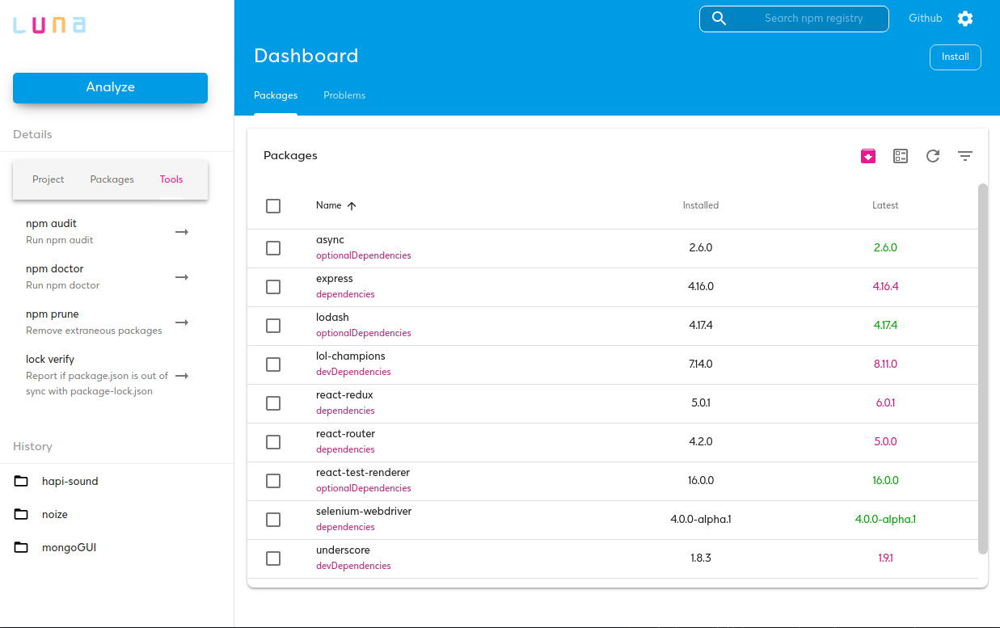

# Luna - NPM management through a modern UI :hibiscus:

npm desktop manager for handling npm packages. Supported platforms: OS X Windows and Linux. Build on <code>Electron</code>

## New release soon

> I am working on the new release with many extra features, rewrite almost every component using React Hooks, new manager API and new design! You can preview my work on develop branch - stay tuned! :eyes:

## Features

- Manage global packages
- Analyze a local directory using package.json
- Search npm for new packages
- Install new packages - multiple
- Uninstall packages - multiple
- Update existing packages
- Preview package details (versions, statistics, dependencies and more)
- Get notifications for missing dependencies

---

