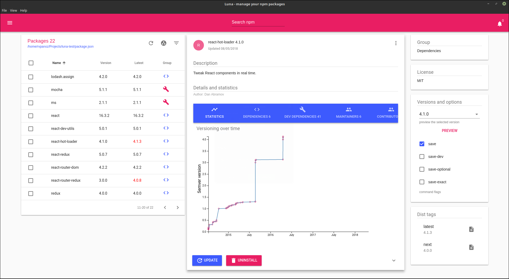

# Luna - NPM management through a modern UI

npm desktop manager for handling npm packages. Supported platforms: OS X Windows and Linux. Build on <code>Electron</code>

## Features

* Manage global packages
* Analyze a local directory using package.json
* Search npm for new packages
* Install new packages - multiple
* Uninstall packages - multiple
* Update existing packages
* Preview package details (versions, statistics, dependencies and more)
* Get notifications for missing dependencies

---

## There have been no commits in X weeks. Is luna dead?

No! It's just that I have other things to do related to my daily job. The software is working just fine as it is. Bugs will be fixed. Some new things will come at some point. Patience... :)

## Downloads

Latest stable release (v2.2.0)

### Linux

Debian [Download](https://github.com/rvpanoz/luna/releases/download/v2.2.0/luna_2.2.0_amd64.deb)

AppImage [Download](https://github.com/rvpanoz/luna/releases/download/v2.2.0/luna-2.2.0-x86_64.AppImage)

### Windows

[Download](https://github.com/rvpanoz/luna/releases/download/v2.2.0/luna-setup-v2.2.0.exe)

### MacOS (v2.1.0)

[Download](https://github.com/rvpanoz/luna/releases/download/v2.1.0/luna-2.1.0-macOS.zip)
_update release soon_

## Development

Install application's dependencies:

`npm install`

In order to start the development server:

`npm run dev`

_As of version 2.2 because there are some core dependencies updates you have to remove the node_modules folders and run a clean install_

## Contribution

If you'd like to make some changes:

1.  Fork this repository to your own GitHub account and then clone it to your local device
2.  Install npm globally and run `npm install` to install application's dependencies
3.  Build and start the application with `npm run dev`
4.  Submit a pull request with your changes :boom:

## Notes

_If you have installed the previous version v1.2.0 you have to remove the node_modules folder and make a clean npm install. Previous version 1.2.0 codebase is now on `UI/bootstrap branch`._

For the previous version of the application you can use the **UI/bootstrap branch**
You have to remove the node_modules folder and run a clean install then use:

`git checkout UI/bootstrap`

`npm install`

if you encounter permission problems on Linux try:

`sudo npm install --allow-root`

## Thanks

Luna is alive thanks to these great libs and frameworks:

_Electron https://electronjs.org/_

_ReactJS https://reactjs.org/_

_Material-ui https://material-ui-next.com/_

> _Webpack https://github.com/webpack/webpack_

> _d3js https://d3js.org/_
