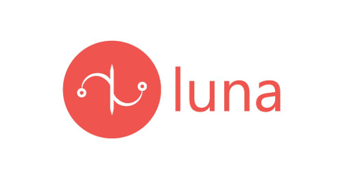
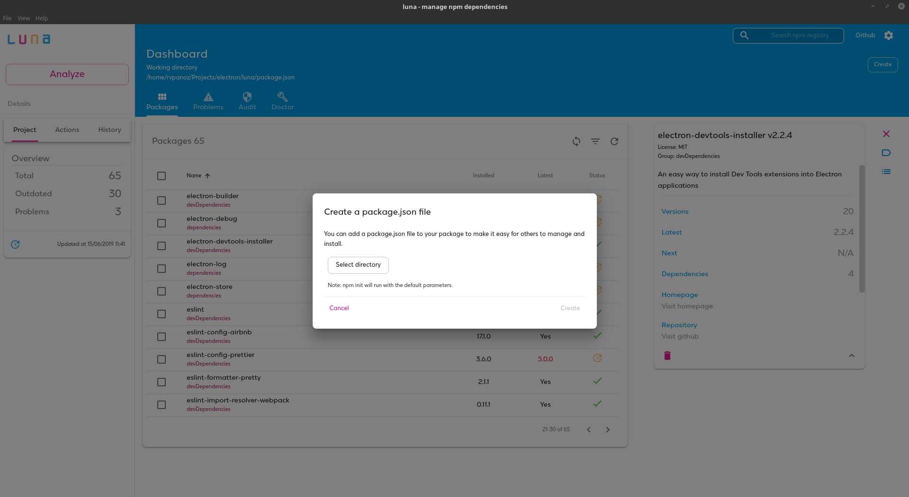
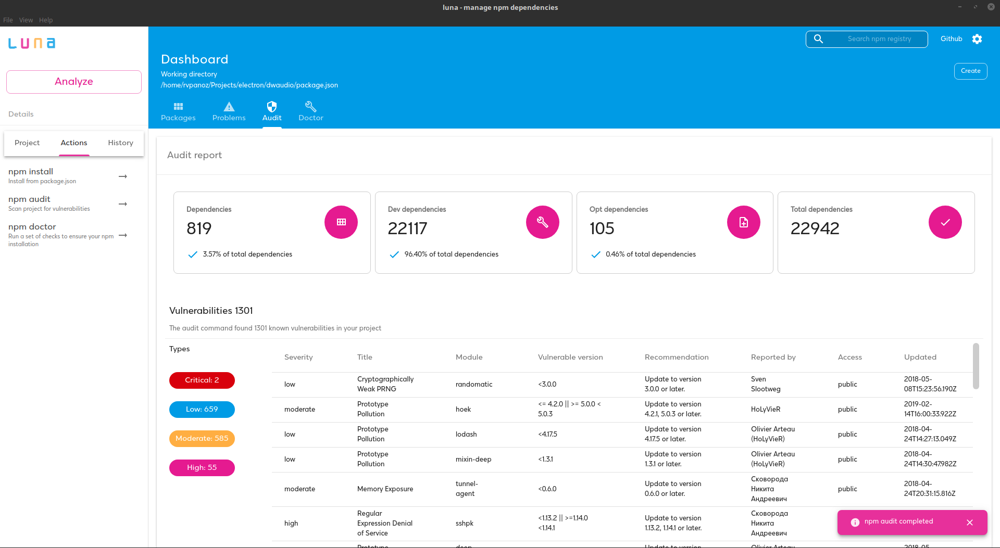

## Luna - npm management through a modern UI. Built with Electron :hibiscus:

  

npm desktop manager for handling npm dependencies. Supported platforms: OS X Windows and Linux.

---

### Motivation

Luna was created with main purpose to handle and install npm dependencies in a ease way. It provides a useful and modern UI in order to enhance the user experience. In addition I wanted to create a project with the latest web technologies combined in one application.

### GreeceJS Presentation

My presentation on GreeceJS meetup
http://bit.ly/2RES3AN

### Features

- Manage global and local packages
- Search npm for new packages
- Install/Update/Uninstall packages
- Uninstall packages
- Update existing packages
- Filter packages by type or outdated
- Preview package details (versions, statistics, dependencies and more)
- Get notifications for missing dependencies or extraneous dependencies
- Run npm tools like npm audit

### Tech Stack

- [Electron](https://electronjs.org//) - [🛠](https://stackshare.io/electron) - [🐙](https://github.com/electron/electron) - Build cross-platform desktop apps with JavaScript, HTML, and CSS
- [React](https://reactjs.org/) - [🛠](https://stackshare.io/react) - [🐙](https://github.com/facebook/react) - React is a JavaScript library for building user interfaces
- [Redux](https://redux.js.org/) - [🛠](https://stackshare.io/reduxjs) - [🐙](https://github.com/reduxjs/redux) - Predictable state container for JavaScript apps
- [Webpack](https://webpack.js.org/) - [🛠️](https://stackshare.io/webpack) - [🐙](https://github.com/webpack/webpack) - A static module bundler for modern JavaScript applications.
- [Babel](https://babeljs.io/) - [🛠️](https://stackshare.io/babel) - [🐙](https://github.com/babel/babel) - A JavaScript compiler; use next generation JavaScript, today.
- [Rxjs](https://rxjs-dev.firebaseapp.com/) - [🛠️](https://stackshare.io/rxjs) - [🐙](https://github.com/Reactive-Extensions/RxJS) - Reactive extensions library for Javascript
- [Material-UI](https://material-ui.com//) - [🛠️](https://stackshare.io/material-ui) - [🐙](https://github.com/mui-org/material-ui) - React components that implement Google's Material Design.

### Screenshots

  

    
  

  

    
  

  

    
  

  

    
  

### Running the application

Install application's dependencies:

`npm install`

Start the application

`npm start`

### Development and Contributing

1. **Fork** the repo on GitHub
2. **Clone** the project to your own machine
3. **Commit** changes to your own branch
4. **Push** your work back up to your fork
5. Submit a **Pull request** so that we can review your changes

> NOTE: Be sure to merge the latest from "upstream" before making a pull request!

Install application's dependencies:

`npm install`

Start the development server and run the app in development mode:

`npm run dev`

### Issues

Luna is a very active project so feel free to submit issues and enhancement requests.

### Binaries

> All binaries of the latest version are uploaded to the releases section

---

### In memory of my friend luna - rest in peace my love :heart:

