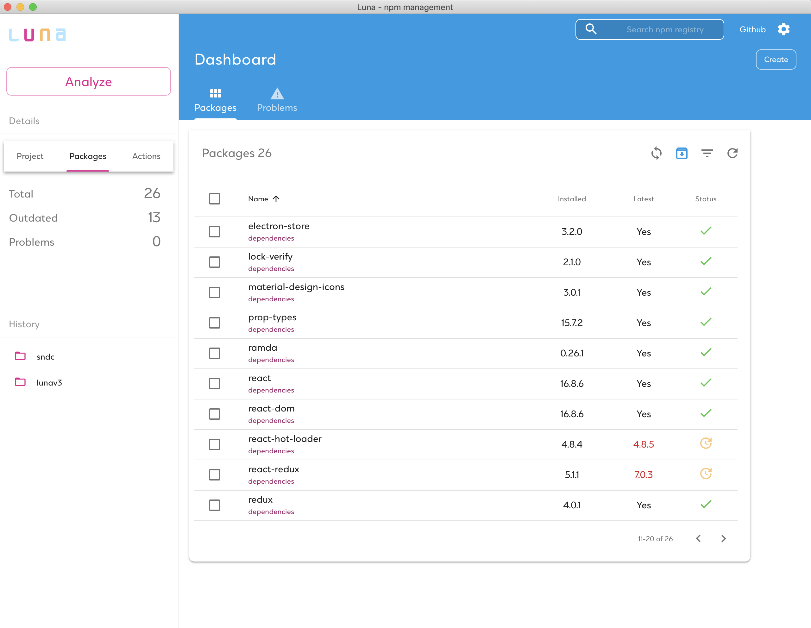
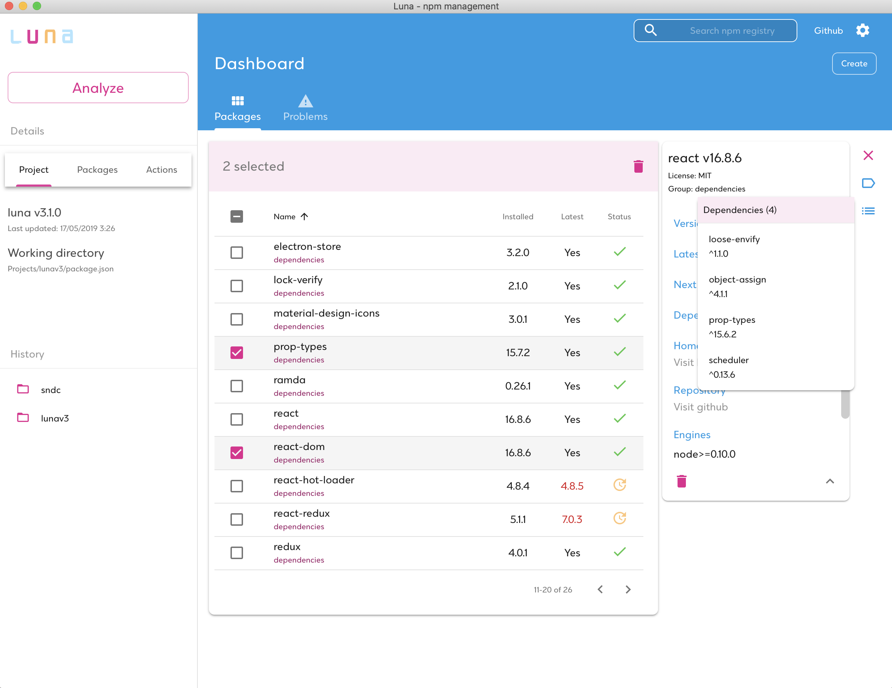
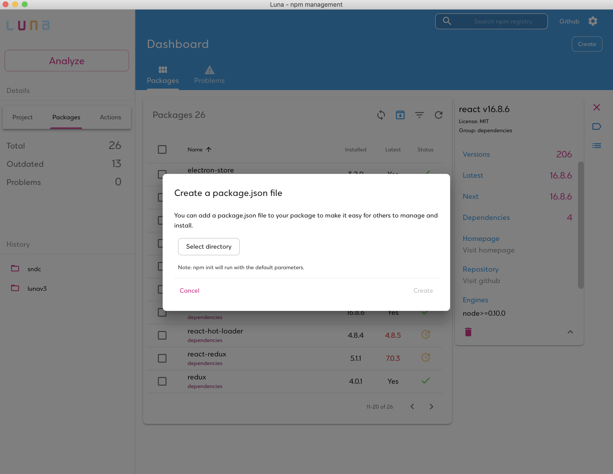
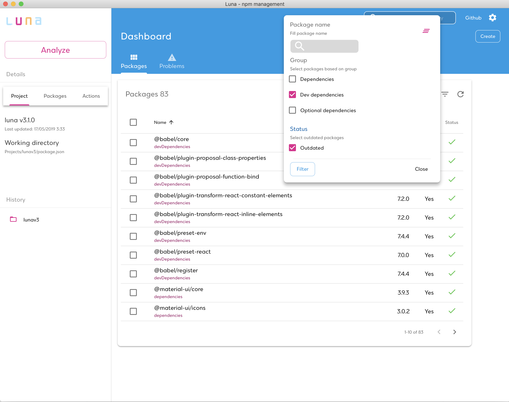

## Luna - npm management through a modern UI.

npm desktop manager for handling npm dependencies. Supported platforms: OS X Windows and Linux. Build on Electron :hibiscus:

### Motivation

Luna was created with main purpose to handle and install npm dependencies in a ease way. It provides a useful and modern UI in order to enhance the user experience. In addition I wanted to create a project with the latest web technologies combined in one application.

### Features

- Manage global and local packages
- Search npm for new packages
- Install/Update/Uninstall packages
- Uninstall packages
- Update existing packages
- Filter packages by type or outdated
- Preview package details (versions, statistics, dependencies and more)
- Get notifications for missing dependencies or extraneous dependencies
- Run npm tools like npm audit

### Build status

### Screenshots

<ul style="padding: 0;margin: 0;list-style: none;display: -webkit-box;display: -moz-box;display: -ms-flexbox;display: -webkit-flex;display: flex;justify-content: space-around">
  <li style="padding: 5px;margin-top:5px">
    
  </li>
  <li style="padding: 5px">
    
  </li>
  <li style="padding: 5px">
    
  </li>
  <li style="padding: 5px">
    
  </li>
</ul>

### Tech Stack

- [Electron](https://electronjs.org//) - [🛠](https://stackshare.io/electron) - [🐙](https://github.com/electron/electron) - Build cross-platform desktop apps with JavaScript, HTML, and CSS
- [React](https://reactjs.org/) - [🛠](https://stackshare.io/react) - [🐙](https://github.com/facebook/react) - React is a JavaScript library for building user interfaces
- [Webpack](https://webpack.js.org/) - [🛠️](https://stackshare.io/webpack) - [🐙](https://github.com/webpack/webpack) - A static module bundler for modern JavaScript applications.
- [Babel](https://babeljs.io/) - [🛠️](https://stackshare.io/babel) - [🐙](https://github.com/babel/babel) - A JavaScript compiler; use next generation JavaScript, today.
- [Rxjs](https://rxjs-dev.firebaseapp.com/) - [🛠️](https://stackshare.io/rxjs) - [🐙](https://github.com/Reactive-Extensions/RxJS) - Reactive extensions library for Javascript
- [Material-UI](https://material-ui.com//) - [🛠️](https://stackshare.io/material-ui) - [🐙](https://github.com/mui-org/material-ui) - React components that implement Google's Material Design.

### Running the application

Install application's dependencies:

`npm install`

Start the application

`npm start`

### Development and Contributing

1. **Fork** the repo on GitHub
2. **Clone** the project to your own machine
3. **Commit** changes to your own branch
4. **Push** your work back up to your fork
5. Submit a **Pull request** so that we can review your changes

NOTE: Be sure to merge the latest from "upstream" before making a pull request!

Install application's dependencies:

`npm install`

In order to start the development server and run the app in development mode:

`npm run dev`

### Issues

Luna is a very active project so feel free to submit issues and enhancement requests.

### Binaries

> binaries for windows and macOS will uploaded soon - stay tuned! :eyes:
>
> if someone wants to help me build on these OS feel free to contact me :)

---

### In memory of my friend luna - rest in peace my love :heart:

