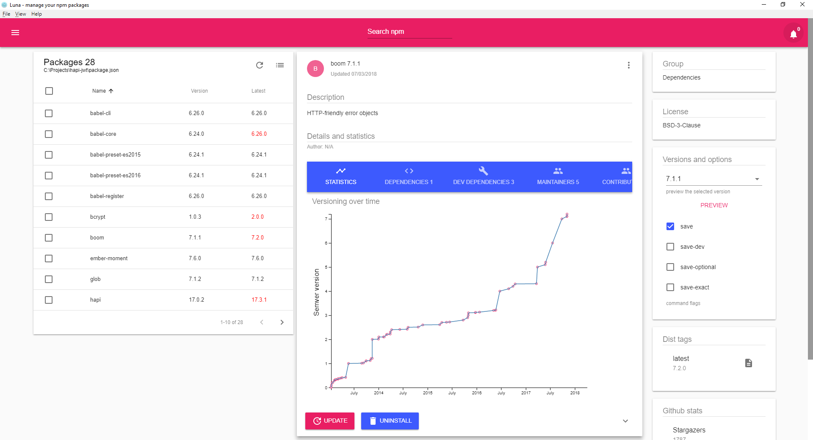

     

 
<h1 align="center">Luna v2 - NPM management throught a modern UI</h1>

  An <code>Electron</code> app for developers for handling npm packages. Supported platforms: OS X Windows and Linux

     
## Features

- Manage global packages
- Analyze a local directory using package.json
- Install new packages - multiple
- Update existing packages - multiple
- Uninstall packages
- Preview selected version
- View package detail info
- Search npm for new packages
- Get notifications for missing dependencies
- Shows Github statistics
- Visualization of package versioning over time - d3js

Luna is alive thanks to these great libs and tools:

> Electron _https://electronjs.org/_

> ReactJS _https://reactjs.org/_

> Material-ui _https://material-ui-next.com/_

> Webpack _https://github.com/webpack/webpack_

> d3js _https://d3js.org/

## Downloads

Latest release

### Linux
Debian [Download](https://github.com/rvpanoz/luna/releases/download/v2.1.0/luna_2.1.0_amd64.deb)

AppImage [Download](https://github.com/rvpanoz/luna/releases/download/v2.1.0/luna-2.1.0-x86_64.AppImage)

### Windows 
[Download](https://github.com/rvpanoz/luna/releases/download/v2.1.0/luna.Setup.2.1.0.exe)

### MacOS
[Download](https://github.com/rvpanoz/luna/releases/download/v2.1.0/luna-2.1.0-macOS.zip)

## Contribution

If you'd like to make some changes yourself:

1. Fork this repository to your own GitHub account and then clone it to your local device
2. Install npm globally and run `npm install` to install application's required packages
3. Build and start the application `npm run dev`
4. Submit a pull request with your changes :boom:

_if you are on linux and get error **gyp WARN EACCES**, run `sudo npm install --allow-root`
maybe you have to delete the node_modules folders first.

## Notes

_If you have installed the previous version v1.2.0 you have to remove the node_modules folder and make a clean npm install. Previous version 1.2.0 codebase is now on `UI/bootstrap branch`._

For the previous version of the application you can use the **UI/bootstrap branch**
You have to remove the node_modules folder and run a clean install then use:

`git checkout UI/bootstrap`

`npm install`

if you encounter permission problems on Linux try:

`sudo npm install --allow-root`
