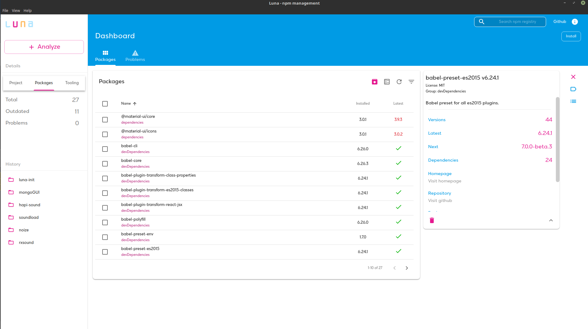

# Luna - npm management through a modern UI :hibiscus:

npm desktop manager for handling npm dependencies. Supported platforms: OS X Windows and Linux. Build on <code>Electron</code>

## Features

- Manage global packages
- Analyze a local directory using package.json
- Search npm for new packages
- Install new packages - multiple
- Uninstall packages - multiple
- Update existing packages
- Filter packages by type or outdated
- Preview package details (versions, statistics, dependencies and more)
- Get notifications for missing dependencies or extraneous dependencies
- Run npm tools like npm audit

---

## Major changes from version 2

- Rewrite almost every component using React Hooks

- Use rxjs/redux-observable to handle Electron's IPC Communication between Renderer and Main Processes

- New design - MaterialUI

- Better API for npm cli

- Bug fixes

- Electron v4 and webpack v4 added

## Binaries

> binaries for windows and macOS will uploaded soon - stay tuned! :eyes:
>
> if someone wants to help me with the build on these OS feel free to contact me :)

## Running

Install application's dependencies:

`npm install`

Start the application

`npm start`

## Development

Install application's dependencies:

`npm install`

In order to start the development server and run the app in development mode:

`npm run dev`

## Thanks

Luna is alive thanks to these great libs and frameworks:

_Electron https://electronjs.org/_

_ReactJS https://reactjs.org/_

_Material-ui https://material-ui-next.com/_

_Webpack https://github.com/webpack/webpack_

_RxJS https://rxjs-dev.firebaseapp.com/_

### In memory of my friend luna - rest in peace my love :heart:

